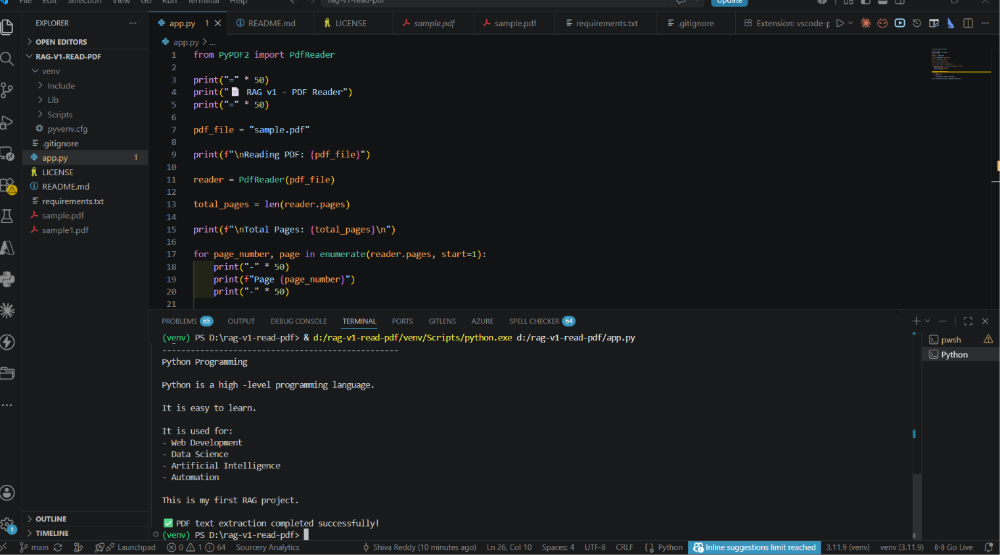

# 📄 RAG v1 – PDF Reader


> **Version 1.0.0** | Foundation of a Retrieval-Augmented Generation (RAG) System

## 📌 Project Overview

Modern AI applications such as ChatGPT, Gemini, and Claude can answer questions based on external documents.... However, Large Language Models (LLMs) cannot directly understand PDF files.

The first step in every Retrieval-Augmented Generation (RAG) system is extracting text from documents.

This project demonstrates that first step by reading a PDF document, extracting its contents, and displaying the text using Python.

This repository is the beginning of my journey toward building a complete production-ready RAG system.

---

# 🚨 Problem Statement

Organizations store important information in documents such as:

* PDF reports
* Research papers
* Company policies
* Technical documentation
* User manuals
* Books

Searching through these documents manually is time-consuming and inefficient.

Traditional keyword search often fails to provide meaningful answers because it lacks context and understanding.

---

# 💡 Solution

This project reads PDF documents and extracts their text automatically.

The extracted text becomes the foundation for future RAG components such as:

* Text Chunking
* Embeddings
* Vector Database
* Semantic Search
* AI-powered Question Answering

---

# 🎯 Objectives

* Learn how PDF processing works
* Understand document ingestion
* Build the first module of a RAG pipeline
* Practice Python project structure
* Prepare for advanced AI development

---

# 🚀 Features

* Read PDF documents
* Count total pages
* Extract text from every page
* Display formatted output in the terminal
* Beginner-friendly code
* Clean project structure

---

# ⚙️ Technologies Used

| Technology | Purpose                 |
| ---------- | ----------------------- |
| Python 3   | Programming Language    |
| PyPDF2     | PDF Processing          |
| Git        | Version Control         |
| GitHub     | Project Hosting         |
| VS Code    | Development Environment |

---

# 📁 Project Structure

```text
rag-v1-read-pdf/
│
├── assets/
│   └── working-pdf.png
├── app.py
├── README.md
├── LICENSE
├── requirements.txt
├── .gitignore
└── sample.pdf (ignored)
```

---

# 🏗️ System Workflow

```
PDF File
    │
    ▼
PyPDF2
    │
    ▼
Read Pages
    │
    ▼
Extract Text
    │
    ▼
Display Output
```

---

# ▶️ Installation

Clone the repository

```bash
git clone https://github.com/Shivareddy83/rag-v1-read-pdf.git
```

Move into the project

```bash
cd rag-v1-read-pdf
```

Create Virtual Environment

```bash
python -m venv venv
```

Activate Virtual Environment

Windows

```bash
venv\Scripts\activate
```

Install Dependencies

```bash
pip install -r requirements.txt
```

Run the project

```bash
python app.py
```

---

# 📋 Requirements

* Python 3.11 or later
* pip
* Git
* VS Code (Recommended)

---

# 🖥️ Sample Output

```
==================================================
📄 RAG v1 - PDF Reader
==================================================

Reading PDF: sample.pdf

Total Pages: 1

--------------------------------------------------
Page 1
--------------------------------------------------

Python Programming

Python is a high-level programming language...

✅ PDF text extraction completed successfully!

```

---

# 📚 Concepts Learned

* Virtual Environments
* Pip Package Management
* PDF Processing
* File Handling
* Python Loops
* Third-party Libraries
* Git
* GitHub

---

# 🛣️ Project Roadmap

* ✅ Version 1 — Read PDF
* ⏳ Version 2 — Text Chunking
* ⏳ Version 3 — Keyword Search
* ⏳ Version 4 — Embeddings
* ⏳ Version 5 — Vector Database
* ⏳ Version 6 — AI Chatbot
* ⏳ Version 7 — FastAPI Backend
* ⏳ Version 8 — Streamlit Interface
* ⏳ Version 9 — Docker
* ⏳ Version 10 — Cloud Deployment

---

# 🎯 Future Improvements

* Save extracted text to file
* Automatic folder scanning
* OCR support for scanned PDFs
* Multiple PDF support
* Logging
* Exception Handling
* Semantic Search
* AI Question Answering

---

# 🤝 Contributing

Contributions, suggestions, and improvements are welcome.

Feel free to fork the repository and submit a pull request.

---

# 📜 License

This project is licensed under the MIT License.

---

# 👨‍💻 Author

**Shiva shankar Reddy**

https://github.com/shivareddy83

Python Developer | Backend Developer | AI & GenAI Learner

Building projects to master Python, Backend Development, and Retrieval-Augmented Generation (RAG).
